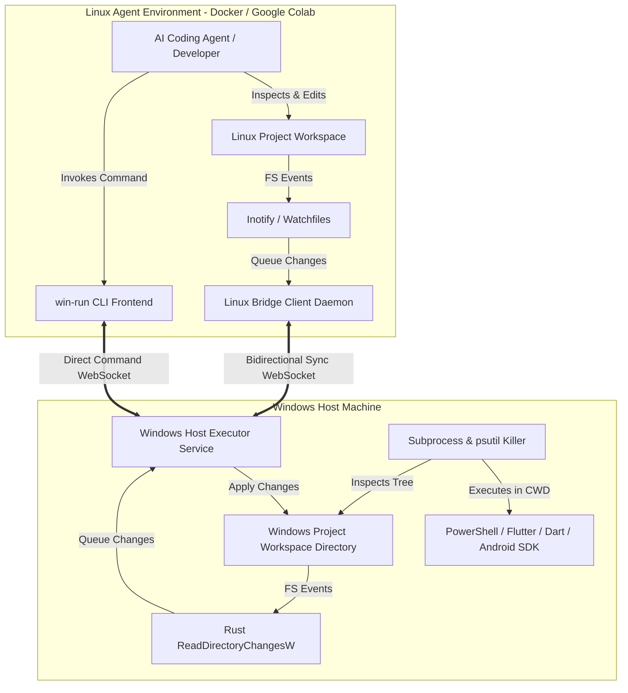

# RemoteDev Hybrid Development Environment: Architecture Document

## 1. Overview and Design Goals

Remote development often faces a fundamental dilemma:
* **Remote Linux environments (e.g., Google Colab, cloud VMs)** have ultra-fast internet connectivity (gigabit speeds), making package installs, model downloads, and AI agent API interactions instantaneous.
* **Local Windows host environments** possess powerful native hardware, full Flutter/Dart/Android SDK installations, emulator/device access, and instant local compilation speed.

**RemoteDev Hybrid Development Environment** bridges both worlds:
1. **Linux Agent Environment**: Acts as the remote development node (Docker container locally, Google Colab in production) containing project files, Linux shell tools, and the AI coding agent.
2. **Windows Host Executor**: Runs as a secure background daemon on Windows, executing native commands (`powershell`, `cmd`, `flutter`, `dart`, `gradle`) on demand with real-time output streaming.
3. **Workspace Synchronization Engine**: Near-real-time bidirectional file sync between Linux and Windows worktrees with deterministic echo suppression, debouncing, and conflict detection.
4. **Command Bridge CLI (`win-run`)**: Seamless command runner allowing the agent or developer to run Windows commands as naturally as local commands.

---

## 2. Architecture Diagram

---

## 3. Core Subsystems

### 3.1 Linux Agent Environment & Runner (`bridge/agent_runner.py`)
* **Runtime**: Ubuntu-based container matching Google Colab's standard x86_64 environment with direct, unrestricted Google AI connectivity.
* **Working Directory**: `/workspace/project`.
* **Agent Reasoning Loop**:
  * Runs autonomously on Linux to bypass Windows ISP restrictions on Google AI services without VPNs or proxies.
  * Connects directly to Google Gemini API at gigabit speeds.
  * Emits live **thought tokens** (`MSG_AGENT_THOUGHT`) and **file access events** (`MSG_AGENT_FILE_ACCESS`) back to the Windows host.
  * Enforces the active **Review Policy** (`request-review`, `always-proceed`, `strict`): whenever modifying tools or commands are invoked, execution suspends and requests confirmation on Windows (`MSG_AGENT_APPROVAL_REQ`).
* **Tooling**: Built-in workspace file tools (`view_file`, `write_to_file`, `replace_file_content`, `list_dir`), local Linux command execution (`run_in_linux`), and transparent Windows host command execution (`run_in_windows` via the bridge).

### 3.2 Windows Host Executor Daemon (`bridge/service.py`)
* **Transport**: Async HTTP/REST and WebSocket server powered by `aiohttp`.
* **Port**: Default `8765`.
* **Subprocess Management (`bridge/executor.py`)**:
  * Spawns unbuffered PowerShell or CMD processes on demand.
  * Streams output chunks over WebSocket in real time (`MSG_COMMAND_OUTPUT`).
  * Enforces execution timeouts and recursive process tree cancellation via `psutil`.
* **Config & Policy Synchronizer**:
  * Discovers workspace rules (`.agents/rules/`), MCP definitions (`.agents/mcp_config.json`), and review policies.
  * Automatically transmits `MSG_CONFIG_SYNC` to the Linux agent upon connection and file change.
* **Agent REST Endpoints**: `POST /agent/prompt`, `POST /agent/cancel`, `POST /agent/approve`, `GET /agent/status`.

### 3.3 Bidirectional Workspace Synchronization Engine (`bridge/sync_engine.py`)
* **Watcher**: High-performance Rust-backed `watchfiles` utilizing `ReadDirectoryChangesW` on Windows and `inotify` on Linux.
* **Debouncing**: Configurable 200ms debounce settle window to accommodate multi-step atomic writes from editors and build tools.
* **Echo Suppression**:
  * In-flight hash registry suppresses redundant reflection loops when remote files are applied.
* **Conflict Handling**:
  * Preserves concurrent edits as `<filename>.conflict_<timestamp>`.
* **Ignore Rules**:
  * Filters `.git/`, `.dart_tool/`, `build/`, `node_modules/`, `.idea/`, `.vscode/`, `infra/`, and temporary files.

### 3.4 Security & Sandboxing Model (`bridge/security.py`)
* **Token Authentication**: Shared secret token evaluated using constant-time comparison (`hmac.compare_digest`) on every WebSocket handshake and REST request.
* **Path Sandboxing**:
  * Strict containment within configured workspace roots on both Windows and Linux.

---

## 4. Communication Protocol Specification

All messages are JSON objects formatted with a required `"type"` string:

| Message Type | Direction | Payload Parameters | Description |
| :--- | :--- | :--- | :--- |
| `auth_req` | Client -> Server | `token`, `client_id`, `role` | Initial authentication handshake |
| `auth_resp` | Server -> Client | `success`, `message`, `server_info` | Authentication result |
| `config_sync` | Server -> Client | `config` (rules, mcp, review_policy) | Synchronizes Antigravity IDE configuration to Linux |
| `agent_start_task` | Server -> Client | `task_id`, `prompt`, `model`, `context` | Dispatches prompt to Linux Agent |
| `agent_cancel_task` | Server -> Client | `task_id` | Cancels running agent reasoning loop |
| `agent_thought` | Client -> Server | `task_id`, `thought`, `timestamp` | Real-time reasoning / chain-of-thought stream |
| `agent_file_access` | Client -> Server | `task_id`, `action` (read/write), `rel_path` | Real-time notification of file inspection or write |
| `agent_tool_call` | Client -> Server | `task_id`, `call_id`, `tool_name`, `args` | Tool invocation notice |
| `agent_tool_result` | Client -> Server | `task_id`, `call_id`, `result` | Tool output report |
| `agent_approval_req` | Client -> Server | `task_id`, `call_id`, `action_desc`, `tool_name` | Review policy approval prompt from Linux |
| `agent_approval_resp` | Server -> Client | `task_id`, `call_id`, `approved`, `reason` | Windows user review approval decision |
| `agent_token` | Client -> Server | `task_id`, `token` | Streaming assistant response token chunk |
| `agent_task_completed` | Client -> Server | `task_id`, `status`, `summary` | Final agent execution status and metrics |
| `execute_command` | Both ways | `command_id`, `command`, `shell`, `cwd`, `timeout` | Request command execution on remote peer |
| `command_started` | Server -> Client | `command_id`, `pid`, `start_time` | Acknowledges process spawn |
| `command_output` | Server -> Client | `command_id`, `stream` (stdout/stderr), `chunk` | Real-time output stream chunk |
| `command_completed` | Server -> Client | `command_id`, `exit_code`, `status`, `duration_ms` | Process exit report |
| `cancel_command` | Client -> Server | `command_id` | Terminate running command process tree |
| `sync_event` | Both ways | `action` (upsert/delete), `rel_path`, `content_b64`, `hash` | Transmits file modifications |
| `status_req` | Client -> Server | None | Requests bridge diagnostics |
| `status_resp` | Server -> Client | `data` (health metrics summary) | Diagnostics snapshot |

---

## 5. Diagnostics System

The Windows Executor exposes real-time diagnostics via:
* **HTTP Endpoint**: `http://localhost:8765/status`
* **CLI Tool**: `win-run status`

Metrics tracked include:
* Real-time connection status and peer network address.
* Sync statistics: total events sent/received, pending debounce queue size, conflict history.
* Command execution: currently running processes, execution history ring buffer (with exit codes, durations, and output tails), and error logs.
